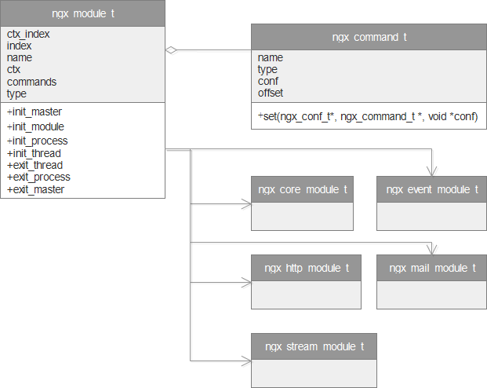

# Nginx模块结构

# `ngx_module_t`

在nginx中，以`ngx_module_t`结构体抽象模块，`ngx_module_t`关联一组`ngx_command_t`命令数组和一个`ngx_*_module_t`上下文。示意图如下：



`ngx_module_t` 定义了7个方法：

  1. `ngx_int_t  (*init_master)(ngx_log_t *log);`
  2. `ngx_int_t  (*init_module)(ngx_cycle_t *cycle);`
  3. `ngx_int_t  (*init_process)(ngx_cycle_t *cycle);`
  4. `ngx_int_t  (*init_thread)(ngx_cycle_t *cycle);`
  5. `void  (*exit_thread)(ngx_cycle_t *cycle);`
  6. `void  (*exit_process)(ngx_cycle_t *cycle);`
  7. `void (*exit_master)(ngx_cycle_t *cycle);`

这7个方法在nginx中会在不同的时机被调用，nginx各功能模块和非功能模块，可以通过这7个方法在不同的时机插入自己的业务代码。
如，`ngx_event_core_module`就通过`init_process`来完成如下几件事情：

  1. 初始化`ngx_posted_accept_events`和`ngx_posted_events`双向链表
  2. 调用`ngx_event_timer_init`初始化定时器
  3. 调用`ngx_event_actions_t`结构体中的`init`方法，如对于epoll模块来说，这方法为：`ngx_epoll_init`
  4. 预创建`cycle->connections`连接数组，并将每个连接关联上读写事件结构体：`ngx_event_t`
  5. 构建`cycle->free_connections`空闲连接列表
  6. 为每个监听端口关联一个`ngx_connection_t`，并将监听套接字的可读事件回调设置为`ngx_event_accept`或`ngx_event_recvmsg`，然后注册监听套接字的可读事件

## `ngx_command_t`

每个`ngx_module_t`可关联一个`ngx_command_t`数组，每个`ngx_command_t`结构对应`nginx.conf`配置文件中的一个指令。`ngx_command_t`结构体定义如下：

``` c++
struct ngx_command_s {
    ngx_str_t              name;
    ngx_uint_t            type;
    char                 *(*set)(ngx_conf_t *cf, ngx_command_t *cmd, void *conf);
    ngx_uint_t            conf;
    ngx_uint_t            offset;
    void                    *post;
};
```

该结构体各成员说明如下：

  * name: 指令名称
  * type: 指令级别和指令参数定义
  * set: 指令解析函数
  * conf: 结构指针偏移
  * offset: 结构体成员偏移
  * post: 不常用

如，解析http配置块的指令定义如下：

``` c++
static ngx_command_t  ngx_http_commands[] = {
    { ngx_string("http"),
      NGX_MAIN_CONF|NGX_CONF_BLOCK|NGX_CONF_NOARGS,
      ngx_http_block,
      0,
      0,
      NULL },

      ngx_null_command
};
```

## 模块上下文(`ngx_*_module_t`)

不同的模块类型有不同的模块上下文，如：

  * `NGX_CORE_MODULE` 类型的模块对应的上文为 `ngx_core_module_t`
  * `NGX_EVENT_MODULE` 类型的模块对应的上下文为 `ngx_event_module_t`
  * `NGX_HTTP_MODULE` 类型的模块对应的上下文为 `ngx_http_mdule_t`
  * `NGX_MAIL_MODULE` 类型的模块对应的上下文为 `ngx_mail_module_t`
  * `NGX_STREAM_MODULE` 类型的模块对应的上下文为 `ngx_stream_module_t`

那么，模块上下文一般承担什么样的职责呢？
如，`ngx_core_module_t`的定义为：

``` c++
typedef struct {
    ngx_str_t             name;
    void               *(*create_conf)(ngx_cycle_t *cycle);
    char               *(*init_conf)(ngx_cycle_t *cycle, void *conf);
} ngx_core_module_t;
```

该上下文结构主要定义了一个配置创建和初始化函数。

如，`ngx_event_module_t`的定义为：

``` c++
typedef struct {
    ngx_str_t              *name;

    void                 *(*create_conf)(ngx_cycle_t *cycle);
    char                 *(*init_conf)(ngx_cycle_t *cycle, void *conf);

    ngx_event_actions_t     actions;
} ngx_event_module_t;
```

该上下文结构同样有配置创建和初始化函数，另外还有类型为`ngx_event_actions_t`的成员，该结构体定义如下：

``` c++
typedef struct {
    ngx_int_t  (*add)(ngx_event_t *ev, ngx_int_t event, ngx_uint_t flags);
    ngx_int_t  (*del)(ngx_event_t *ev, ngx_int_t event, ngx_uint_t flags);

    ngx_int_t  (*enable)(ngx_event_t *ev, ngx_int_t event, ngx_uint_t flags);
    ngx_int_t  (*disable)(ngx_event_t *ev, ngx_int_t event, ngx_uint_t flags);

    ngx_int_t  (*add_conn)(ngx_connection_t *c);
    ngx_int_t  (*del_conn)(ngx_connection_t *c, ngx_uint_t flags);

    ngx_int_t  (*notify)(ngx_event_handler_pt handler);

    ngx_int_t  (*process_events)(ngx_cycle_t *cycle, ngx_msec_t timer,
                                 ngx_uint_t flags);

    ngx_int_t  (*init)(ngx_cycle_t *cycle, ngx_msec_t timer);
    void       (*done)(ngx_cycle_t *cycle);
} ngx_event_actions_t;
```

该结构体试图抽象不同平台的网络I/O接口。

`ngx_http_module_t`的定义为：

``` c++
typedef struct {
    ngx_int_t   (*preconfiguration)(ngx_conf_t *cf);
    ngx_int_t   (*postconfiguration)(ngx_conf_t *cf);

    void       *(*create_main_conf)(ngx_conf_t *cf);
    char       *(*init_main_conf)(ngx_conf_t *cf, void *conf);

    void       *(*create_srv_conf)(ngx_conf_t *cf);
    char       *(*merge_srv_conf)(ngx_conf_t *cf, void *prev, void *conf);

    void       *(*create_loc_conf)(ngx_conf_t *cf);
    char       *(*merge_loc_conf)(ngx_conf_t *cf, void *prev, void *conf);
} ngx_http_module_t;
```

该上下文结构定义了不同层级的配置创建和合并函数。

从上面的例子可以看出，模块上下文主要用于：

  1. 创建和初始化（或合并）配置结构
  2. 表达业务模块独有的概念，如在事件模块中，定义了 `ngx_event_actions_t` 结构来表示一系列的网络I/O行为
